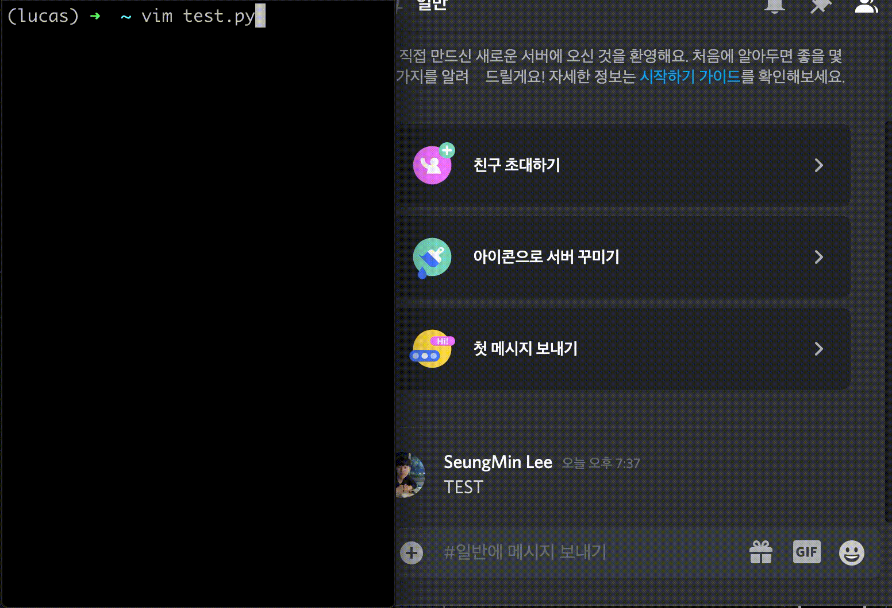

# Bwa: Simple Notification Sender

[](https://pypi.org/project/bwa/)
[]()
[](https://github.com/somniumism/bwa/blob/main/LICENSE)
[](https://pepy.tech/project/bwa)

Document: [English](https://github.com/somniumism/bwa) | [한국어](https://github.com/somniumism/bwa/blob/main/docs/README.kr.md)

Notion page: [English](https://www.notion.so/somniumis/Bwa-Simple-Notification-Sender-a9919a46f2d64d11baab60deb4e8de55) | [한국어](https://www.notion.so/somniumis/Bwa-Simple-Notification-Sender-0146f53d2f3f4807b029bdf6f7bfd7a9)

More specific details can be accessed from the Notion page below: [Bwa: Simple Notification Sender](https://www.notion.so/somniumis/Bwa-Simple-Notification-Sender-a9919a46f2d64d11baab60deb4e8de55)

<p align="center">
      
</p>

**bwa** is a simple notifcation sender, that can send notifications related to the execution of functions by using *a single decorator*. With few client settings, just insert the decorators right above some functions. You can receive a notification when the function starts, completes, or raises an unexpected error. Currently, **bwa** supports four clients; `Discord`, `Slack`, `Telegram` and `Gmail`.

If you set your webhook url as an environment variable, you will be notified quite simply as follows:

```python
from bwa.discord import deco_noti

@deco_noti()
def run():
    print("Hi, bwa!")
```
You need to export some variables for connection to messaging services (e.g. web-hook url for Discord). Please refer to the following Notion page for detailed instructions of each client.

- Detailed instruction and usage: [Bwa: Simple Notification Sender](https://www.notion.so/somniumis/Bwa-Simple-Notification-Sender-a9919a46f2d64d11baab60deb4e8de55)

- Supported messaging services:  
    - [Discord](https://www.notion.so/somniumis/Discord-231544b268b64a42b3d084d1aa3c3d96) : `bwa.discord`
    - [Slack](https://www.notion.so/somniumis/Slack-5633bf0e13ab4e499e2b2c677852dbbf) : `bwa.slack`
    - [Telegram](https://www.notion.so/somniumis/Telegram-888407c4770a4b5a806a9c7c65e45250) : `bwa.telegm`
    - [Gmail](https://www.notion.so/somniumis/Gmail-197fc3dcf2f74c9dba651afb19267747) : `bwa.gmail`

Note that the module for `telegram` is `bwa.telegm`, not `bwa.telegram`

## Installation

You can install **bwa** simply via `pip`.

```bash
pip install bwa==1.1.1
```

## Usage

**bwa** provides the decorator `@deco_noti()` and the method `send_noti()`. `@deco_noti()` lets you receive notifications about the start, complete, unexpected shutdown of your function. In addition, if you add `send_noti()` anywhere in your code, you will be notified when that code is executed.

As above explanation, **bwa** sends notifications via Discord(`bwa.discord`), Slack(`bwa.slack`), Telegram(`bwa.telegm`) and Gmail(`bwa.gmail`). The required parameters differ by messaging service. The essential variable(s) are as follows:

- [bwa.discord](https://www.notion.so/somniumis/Discord-231544b268b64a42b3d084d1aa3c3d96#f3fe6caaaaf8441a829e1bfbd577ba0c)  
    `webhook_url` or environment variable `DISCORD_WEBHOOK_URL` : webhook url of your Discord server 
    
- [bwa.slack](https://www.notion.so/somniumis/Slack-5633bf0e13ab4e499e2b2c677852dbbf#6d2f20e33fc74b728813b0ddcb63ba69)  
    `webhook_url` or environment variable `SLACK_WEBHOOK_URL`: webhook url of your Slack server 

- [bwa.telegm](https://www.notion.so/somniumis/Telegram-888407c4770a4b5a806a9c7c65e45250#2b2295b99afb4489b24a6775dc23e0e4)  
    `token` or environment variable `TELEGRAM_TOKEN` : token of your telegram bot  
    `chat_id` or environment variable `TELEGRAM_CHAT_ID` : chat id of your telegram bot  

- [bwa.gmail](https://www.notion.so/somniumis/Gmail-197fc3dcf2f74c9dba651afb19267747#58e9db16a1544a9484a88d2d5857c5ba)  
    `receiver_emails` : email addresses of the receiver (who want to get notifications)
    `sender_email` or environment variable `SENDER_EMAIL` : sender's Gmail address  
    `sender_password` or environment variable `SENDER_PASSWORD` : sender's Gmail password

Please refer to our [Notion page](https://www.notion.so/somniumis/Bwa-Simple-Notification-Sender-a9919a46f2d64d11baab60deb4e8de55) for the detailed definition of each parameter.

Also, please refer to [/examples](https://github.com/somniumism/bwa/tree/main/examples) in Github for the example code of each client.

## Output format(Default)

**bwa** provides `custom_content` parameter to send your own messages. If `custom_content` do no exists, you will be notified in the default format as follows. (It may differ from the actual result as following is just an *example*.)

### When the function starts:

```
🏃 Your function <function_name> has started.
    - function name: function_name
    - start time: 2020-10-27 20:47:32
```

### When the function is complete:

```
🎉 Your function <function_name> is complete!
    - function name: function_name
    - start time: 2020-10-27 20:47:24
    - end time: 2020-10-27 20:47:27
    - run time: 0:00:02.970100
```

### When the function is ended due to an unexpected error:

```
😭 Your function <function_name> ended unexpectedly due to an exception or error.
    - function name: function_name
    - start time: 2020-10-25 01:25:06
    - dead time: 2020-10-25 01:25:12
    - run time: 0:00:05.774958
    - Error Info:

    - Traceback:
    Traceback (most recent call last):
    File "/Users/test-user/test/gmail_test_case.py", line 83, in wrapper
```

## FAQ

Q. What does **bwa** mean?

A: **bwa** means *look* in Korean.
Importing `bwa.discord` can be translated into `look at your discord` in Korean.


Q. How **bwa** differs from **knockknock** of Huggingface?

A: I found many inconveniences while using `knockknock` as a notification tool.

1. `knockknock` cannot send a custom message. You have to send the message only in the format pre-defined in the library.

2. Because `knockknock` does not support environment variables, you must write all parameters when using the decorator. In other words, the decorator should be much longer (not a simple way).

3. You may want to be notified about the execution of the line rather than the execution of the function, but it is not possible with `knockknock`, which only supports the decorator.

So I designed **bwa** to support all of the above functions and create a simply, pretty and user-friendly library.

- **bwa** provides `custom_content` parameter so that you can send messages you want.

- **bwa** supports using environment variables. You can get notified in a very simple and pretty way, like `@deco_noti()`.

- **bwa** provides a method `send_noti()` so that you can be notified on any line without being bounded to the function.

Greatest: `knockknock` is 10 letters, but `bwa` is 3 letters. The shorter name gives you less key strokes.

## Reference & Copyright

Referred to huggingface's [knockknock](https://github.com/huggingface/knockknock)

If you have any questions or any problems, please leave a Github issue or contact me by email.

Any advice, pull request, and collaboration that can be used on more diverse platforms or make it easier to send a notification is always welcome. : )

If you find something that you don't understand or have a wrong grammar in the English document, please contact or contribute at any time.

Copyright (c) 2020 SeungMin Lee | MIT License  
Author: SeungMin Lee(@somniumism)  
Contact: lsm.somniator@gmail.com
