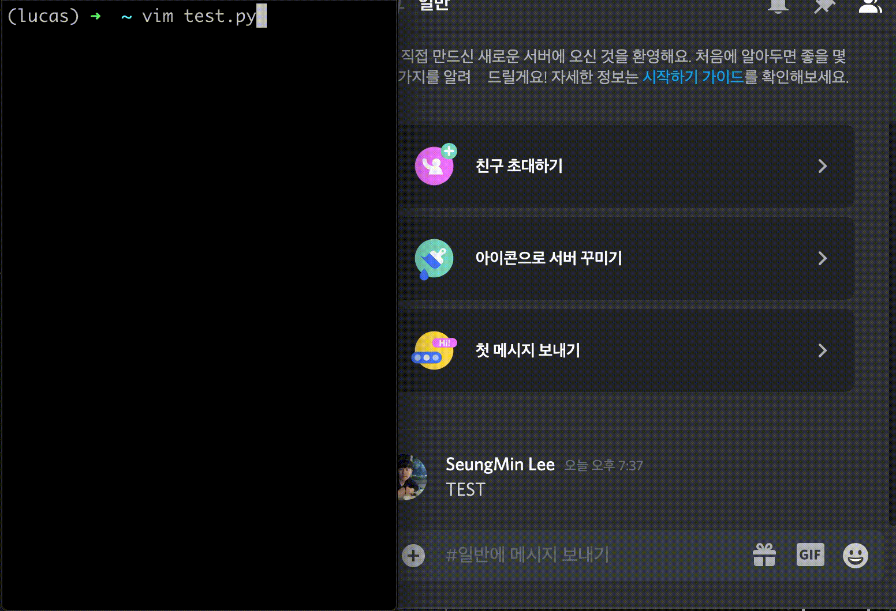

# 봐(Bwa): Simple Notification Sender

[](https://pypi.org/project/bwa/)
[]()
[](https://github.com/somniumism/bwa/blob/main/LICENSE)
[](https://pepy.tech/project/bwa)

노션에서 더 상세한 정보를 얻으실 수 있습니다: [봐(Bwa): Simple Notification Sender](https://www.notion.so/somniumis/Bwa-Simple-Notification-Sender-0146f53d2f3f4807b029bdf6f7bfd7a9)

<p align="center">
      
</p>

**bwa**는 데코레이터를 통해 함수 실행과 관련된 알림을 간단하게 보낼 수 있는 툴입니다. 여러분이 만든 함수 위에 `deco_noti()`와 몇 가지의 클라이언트 설정만 해주면, 함수가 시작되거나 끝나거나 혹은 예기치 못한 에러로 인해 종료되었을 때, 클라이언트로부터 알림을 받을 수 있습니다. 현재 `디스코드`, `슬랙`, `텔레그램` 그리고 `Gmail`을 통해 알림을 받을 수 있습니다.

가령 환경 변수로 webhook url 주소를 설정한다면, 다음과 같이 아주 간단하게 알림을 받을 수 있습니다.
```python
from bwa.discord import deco_noti

@deco_noti()
def run():
    print("Hi, bwa!")
```

알림을 받기 위해서는 클라이언트에서 몇 가지 설정 혹은 web-hook url과 같은 정보를 받아야 합니다. 클라이언트 별로 상세한 사용 방법은 아래의 노션에 정리했으니, 참고 부탁드립니다.

- 상세 사용법: [봐(Bwa): Simple Notification Sender](https://www.notion.so/somniumis/Bwa-Simple-Notification-Sender-0146f53d2f3f4807b029bdf6f7bfd7a9)

- 지원되는 플랫폼:
    - [디스코드](https://www.notion.so/somniumis/7fb085f008814a8d88b49ea211d6a1ac) : `bwa.discord`
    - [슬랙](https://www.notion.so/somniumis/63871567eece4949bea89a7496a0c714) : `bwa.slack`
    - [텔레그램](https://www.notion.so/somniumis/545c468662aa4368a7abbfc09ce30c7a) : `bwa.telegm`
    - [Gmail](https://www.notion.so/somniumis/G-87c1f64a8694411cb942315e3623770e) : `bwa.gmail`


## Installation

`pip`를 통해 설치할 수 있습니다. 아래의 커맨드를 통해 설치를 해주시면 됩니다.

```bash
pip install bwa==1.1.1
```


## Usage

**bwa** 는 `deco_noti()`라는 데코레이터와 `send_noti()`라는 메소드를 제공합니다. `deco_noti()`를 통해 함수의 시작, 끝, 예기치 못한 종료 등에 대한 알림을 받을 수 있습니다. 그리고 `send_noti()`를 여러분의 코드에 추가하면, 그 코드가 실행될 때 알림을 받을 수 있습니다.

앞서 설명드린 것과 같이, **bwa**는 디스코드(`bwa.discord`), 슬랙(`bwa.slack`), 텔레그램(`bwa.telegm`) 그리고 G메일(`bwa.gmail`)을 통해 알림을 송수신할 수 있는 기능을 가지고 있습니다. 클라이언트의 종류에 따라 필요한 파라미터가 다릅니다. 그 차이는 아래와 같습니다.

- [bwa.discord](https://www.notion.so/somniumis/7fb085f008814a8d88b49ea211d6a1ac)  
    `webhook_url` 혹은 환경변수 `DISCORD_WEBHOOK_URL` : 서버의 웹후크 URL  
    
- [bwa.slack](https://www.notion.so/somniumis/63871567eece4949bea89a7496a0c714)  
    `webhook_url` 혹은 환경변수 `SLACK_WEBHOOK_URL`: 서버의 웹후크 URL  

- [bwa.telegm](https://www.notion.so/somniumis/545c468662aa4368a7abbfc09ce30c7a)  
    `token` 혹은 환경변수 `TELEGRAM_TOKEN` : 텔래그램 봇의 토큰  
    `chat_id` 혹은 환경변수 `TELEGRAM_CHAT_ID` : 텔레그램 봇의 챗 아이디  

- [bwa.gmail](https://www.notion.so/somniumis/G-87c1f64a8694411cb942315e3623770e)  
    `receiver_emails` : 수신인들의 Gmail 주소  
    `sender_email` 혹은 환경변수 `SENDER_EMAIL` : 발신인의 Gmail 주소  
    `sender_password` 혹은 환경변수 `SENDER_PASSWORD` : 발신인의 비밀번호

각 파라미터가 무엇을 의미하는지, 어떻게 취득할 수 있는지에 대한 설명은 [노션 페이지의 사용법](https://www.notion.so/somniumis/Bwa-Simple-Notification-Sender-0146f53d2f3f4807b029bdf6f7bfd7a9#56f710fbb5c942df81801dcaf6f530bf)을 참고해주시면 감사드리겠습니다.

또한 각 클라이언트에 대한 예시는 Github의  [/examples](https://github.com/somniumism/bwa/tree/main/examples)에서 참고해주시면 감사드리겠습니다.


## Output example

**bwa**는 여러분이 원하는 메시지를 직접 만들 수 있도록 `custom_contents` 파라미터를 제공하고 있습니다. 하지만 `custom_contents`를 입력하지 않을 경우에, **bwa**에서 임의로 기재된 기본 메시지를 통해 알림을 받습니다. 기본 메시지의 포맷 예시는 다음과 같습니다. 예시이기 때문에 실제로 조금의 차이가 있을 수 있습니다.

### 함수가 시작될 때

```
🏃 Your function <function_name> has started.
    - function name: function_name
    - start time: 2020-10-27 20:47:32
```

### 함수가 종료될 때

```
🎉 Your function <function_name> is complete!
    - function name: function_name
    - start time: 2020-10-27 20:47:24
    - end time: 2020-10-27 20:47:27
    - run time: 0:00:02.970100
```

### 예기치 못한 오류로 인해 함수가 죽었을 떄

```
😭 Your function <function_name> ended unexpectedly due to an exception or error.
    - function name: function_name
    - start time: 2020-10-25 01:25:06
    - dead time: 2020-10-25 01:25:12
    - run time: 0:00:05.774958
    - Error Info:

    - Traceback:
    Traceback (most recent call last):
    File "/Users/test-user/test/gmail_test_case.py", line 83, in wrapper
```
## FAQ

Q. What is the difference between Huggingface's **knockknock** and **bwa**?

A: I used `knockknock` a lot, and there were many inconveniences while using `knockknock`.

1. `knockknock` cannot send the custom message that the user wants. You have to send the message only in the format made by them.

2. Because `knockknock` does not support environment variables, you must write all parameters when using the decorator. In other words, it's not pretty and it's not simple.

3. `knockknock` only supports decorator. You may want to be notified about the execution of the line rather than the execution of the function. But it is not possible in `knockknock`, which only supports decoder.

So I designed the bwa to support all of the above functions and create a simply, pretty and user-friendly library.

- **bwa** provides a parameter `custom_content` so that you can send the message you want.

- **bwa** supports you to use environment variables. So you can use it very simply and pretty, like `@deco_noti()`.

- **bwa** provides a method `send_noti()` so that you can be notified on any line without being restricted to the function.

## Reference & Copyright

Referred to huggingface's [knockknock](https://github.com/huggingface/knockknock)

Copyright (c) 2020 SeungMin Lee | MIT License  
Author: SeungMin Lee(@somniumism)  
Contact: lsm.somniator@gmail.com

오류나 기타 문의 사항이 있으면 Github issue를 남겨주시거나 위 메일로 연락을 주시면 감사드리겠습니다.  

더 다양한 플랫폼에서 사용될 수 있도록, 혹은 더 편하게 노티를 보낼 수 있도록 하는 모든 조언, PR, 협업을 기다리고 있습니다. : )
